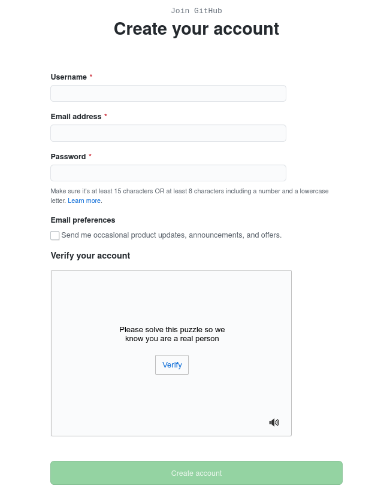
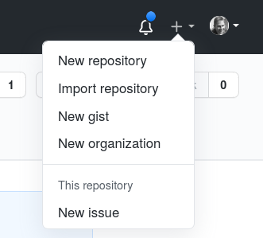
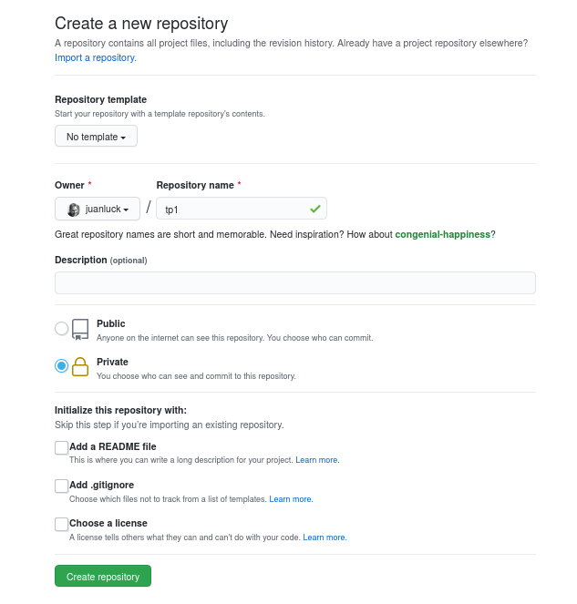
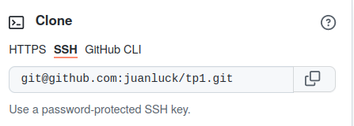
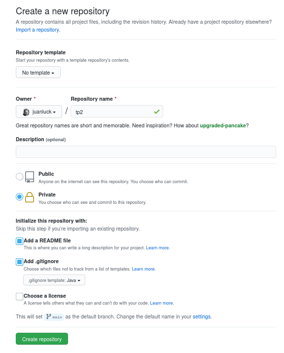
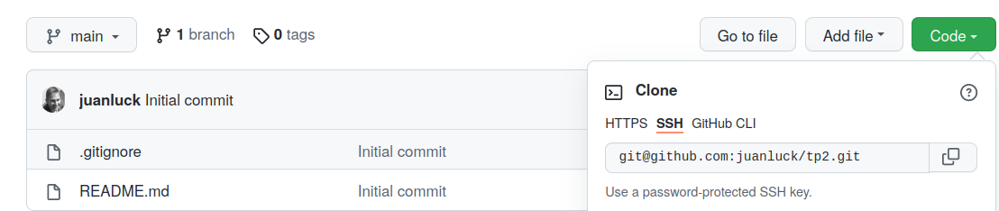

<style>
.note {
  min-height: 17px;
  margin: 4px 0 2px;
    margin-bottom: 2px;
  font-size: 12px;
  color: #000000;
  font-size: 14px !important;
  padding: 16px !important;
  margin-bottom: 24px !important;
  border-color: #000000; !important;
  background-color: rgba(84,174,255,0.4); !important;
  border-radius: 4px !important;
  border: 1px solid #000000; !important;
}
</style>

<a id='TP2'></a>
# TP 2 : Travailler en autonomie sur un depôt github distant 
[Retour à la page principale](../index.md)


Jusqu'à présent (dans le [TP1](../tp1/index.md)), nous avons travaillé sur un dépôt local. Cependant, le vrai pouvoir de git est de pouvoir travailler avec un dépôt distant (généralement hébergé sur un serveur externe), ce qui présente les avantages suivants: i) avoir une copie de sauvegarde du projet, ii) possibilité d'accéder au projet depuis différentes machines et iii) possibilité de travailler en équipe sur le même projet. 

Dans ce TP, nous allons travailler de manière autonome (il n'y a toujours pas de travail d'équipe) sur un dépôt distant. Vous connaissez sûrement déjà certaines de ces plateformes de gestion de projets : il en existe plusieurs. **Les plus connues :**

[Github](https://github.com) :
:	La plateforme la plus connue. Héberge gratuitement des projets. Souscriptions pour plus de fonctionalités. Le code est hébergé chez github.

[Bitbucket](https://bitbucket.org) : 
:    Similaire à github. Programme étudiant (avec l’email universitaire). Le code est hébergé par Atlasian.

[Gitlab](https://about.gitlab.com/) :
:    Similaire aux précédents dans sa version commerciale (Entreprise Edition). Une version open source (Community Edition) permet l’installation privée d’un serveur.

---

## Objectifs du TP 2

Le but de ce deuxième TP  est de commencer à travailler en autonomie (pas de travaille en équipe pour l'instant) avec un dépôt git distant. En particulier, nous travaillerons avec le système github. Dans ce TP, nous allons apprendre à : 

>1. [Créer un compte sur github](#github)
2. [Ajouter une nouvelle clé SSH à votre compte GitHub](#cle)
3. [Pousser un dépôt existant depuis la ligne de commande](#pushremote)
4. [Séquence de travail avec un dépôt distant](#sequence)
5. [Cloner un dépôt distant sur notre machine locale](#clone)
   

[Haut de la page](#TP2)

---

<a id='github'></a>
## 1. Créer un compte sur github 

Peut-être que certains d'entre vous avez déjà un compte github. Si tel est le cas, vous pouvez ignorer cette première étape. Sinon, créer un compte sur github est simple : 

1. Vous devez aller sur [github](https://github.com) et cliquer sur **sign up** pour vous insrire : 

2. Ensuite, vous devez remplir les champs suivants du formulaire. Prenez quelques minutes pour créer votre compte. 



---
<a id='cle'></a>
## 2. Ajouter une nouvelle clé SSH à votre compte GitHub 

Pour des raisons de sécurité, GitHub base ses connexions sur un système de clé publique/privée. Cette section vous permet de configurer ces clés sur github. 

- Copiez la clé publique SSH de votre machine dans votre presse-papiers. 

```shell
$ cat ~/.ssh/id_rsa.pub
# Sélectionnez ensuite et copiez le contenu du fichier id_rsa.pub 
# affiché dans le terminal dans votre presse-papiers 
```

<div class="note">
<p><strong>Attention : </strong>  la clé publique est celle qui se termine par .pub, ne partagez jamais votre clé privée.</p>

<p> Le fichier id_rsa.pub est le nom par défaut, mais peut-être que votre fichier est nommé différemment, par exemple identifiant.pub ou autrement </p>

<p> Si vous n'avez pas de paire de clés publique/privée dans votre repertoire .ssh, la commande <code>ssh-keygen</code> permet de générer une paire de clés publique/privée rsa. </p>
</div>

- Dans le coin supérieur droit, cliquez sur votre photo de profil, puis sur Settings.

 
 
- Dans la section "Accès" de la barre latérale, cliquez sur **SSH and GPG keys**

- Cliquez sur **Nouvelle clé SSH** ou sur **Ajouter une clé SSH**

-  Dans le champ "Titre", ajoutez une étiquette descriptive pour la nouvelle clé. Par exemple, si vous utilisez une machine à l'IUT, vous pouvez appeler cette clé "Machine IUT"

- Collez votre clé dans le champ "Clé"

- Cliquez sur "Ajouter la clé SSH". 

- Si demandé, confirmez votre mot de passe GitHub. 

- Vous pouvez répéter ce processus pour autant de machines que vous allez utiliser. 

[Haut de la page](#TP2)

-----

<a id='pushremote'></a>
## 3. Pousser un dépôt existant depuis la ligne de commande 

Jusqu'à présent, nous avons travaillé sur le dépôt git local `tp1`, il est temps de sauvegarder ce dépôt sur github. Pour ce faire, nous allons suivre une description qui montre comment le faire étape par étape. Mais tout d'abord, il est pratique de faire une brève introduction de trois commandes dans git qui nous aideront à gérer notre répertoire distant à partir de notre répertoire local sur la ligne de commande. 

* `git remote` :
: cette commande sert à gérer (ajouter) des dépôts distants ("remotes"). En d'autres termes, nous utiliserons cette commande pour créer un lien entre notre dépôt local `tp1` et celui distant que nous allons créer dans github. 

* `git push` :
: cette commande permet de mettre à jour le dépôt distant (e.g. github) à partir de la dernière version validée (_commit)_ de notre dépôt local. 

* `git pull` :
: cette commande sert à mettre à jour notre dépot local à partir de la dernière version de notre dépôt distant. 

**Êtes-vous prêts ? Allons commencer à travailler avec github !!** La première tâche sera de sauvegarder une copie de notre répertoire local `tp1` sur github. 

* Allez jusqu'au répertoire tp1, de sorte que la commande `pwd` affiche le résultat suivant :

```shell
$:> pwd
/.../courseGIT/tp1 
```

* Sur le site Web de github, allez en haut à droite et cliquez sur **New repository** comme indiqué dans l'image :



* Dans le formulaire, tapez **tp1** sous **Repository name** et laissez le reste des champs vides (comme indiqué dans l'image). Vous pouvez choisir que votre dépôt `tp1` soit public ou privé. 



* Vous venez de créer un dépôt vide dont le lien `https://github.com/<votre_utilisateur>/tp1.git` sera affiché comme dans l'image ci-dessous. 



* Tapez dans la console la ligne suivante pour vérifier que votre dépôt local `tp1` n'est pas encore lié à un dépôt distant. La réponse de cette commande ne doit rien afficher. 

```shell
$:~/courseGIT/tp1> git remote -v
```

* Maintenant, nous allons lier notre dépôt local `tp1` au répertoire distant `git@github.com:<votre_utilisateur>/tp1.git` pour ce faire, écrivez la commande suivante en remplaçant `<votre_utilisateur>` par votre utilisateur. 

```shell
$:~/courseGIT/tp1> git remote add origin git@github.com:<votre_utilisateur>/tp1.git
```
* Jusqu'à présent, nous n'avons pas examiné le concept de branche dans git, et nous n'entrerons pas dans le détail avant la prochaine séance. Cependant, il faut savoir que toutes les versions que nous sauvegardons avec les différentes _commits_ sont stockées dans une branche. Normalement cette branche s'appellera **master** ou **main**. Pour finir d'établir le lien entre le dépôt local et distant, nous aurons besoin de connaître le nom de cette branche. Pour ce faire, tapez la commande suivante : 

```shell
$:~/courseGIT/tp1> git branch
*master
```
* Il ne reste plus qu'à créer le lien de manière permanente et mettre à jour le dépôt distant. Pour ce faire, écrivons la commande suivante: 

```shell
$:~/courseGIT/tp1> git push -u origin master
```

* Alors que la commande `git push` essaie d'écrire dans le dépôt distant, vous devriez voir des messages similaires à :

```shell
Counting objects: 19, done.
Delta compression using up to 4 threads.
Compressing objects: 100% (14/14), done.
Writing objects: 100% (19/19), 2.11 KiB | 0 bytes/s, done.
Total 19 (delta 0), reused 0 (delta 0)
To https://github.com/juanluck/tp1.git
 * [new branch]      master -> master
Branch master set up to track remote branch master from origin.
```
* **Félicitations !!** les deux dépôts, local et distant, sont maintenant synchronisés. Allez sur le site de votre projet `https://github.com/<votre_utilisateur>/tp1` et voir les résultats. **N'est-ce pas cool ?**

[Haut de la page](#TP2)

-----

<a id='sequence'></a>
## 4. Séquence de travail avec un dépôt distant 

Dans le [tp1](../tp1/index.md), nous avons vu comment établir une séquence de travail simple dans un répertoire local pour enregistrer la trace des différentes versions de notre projet à l'aide de la séquence de commandes suivant : `git status` -> `git add fichier` -> `git commit -m "message"` -> `git status` -> `git add fichier` -> `...`

Une fois que le lien entre notre dépôt local et distant a été établi, nous allons introduire les commandes `git pull` et` git push` dans cette séquence et ainsi pouvoir synchroniser le _commit_ local avec le dépôt distant . En bref, cette séquence se compose des commandes suivantes :


* Tout d'abord, nous allons _puller_ (télécharger et synchroniser) la version la plus récente du dépôt distant vers notre dépôt local :

```shell
$:~/courseGIT/tp1> git pull
```

* **(Optionnel )** Nous pouvons voir les modifications les plus récentes (écrites par nous ou un collègue) si nous tapons :

```shell
$:~/courseGIT/tp1> git log
```

* Une fois que nous avons la version la plus récente, nous pouvons commencer à introduire des modifications dans nos fichiers locaux et effectuer la séquence que nous connaissons déjà pour enregistrer la nouvelle version dans notre référentiel local :

```shell
$:~/courseGIT/tp1> git status
$:~/courseGIT/tp1> git add .
$:~/courseGIT/tp1> git commit -m "Message pour le log"
```

* Finalement, une fois que notre référentiel local a la bonne version, il suffit de le synchroniser (_pusher_) avec le dépôt distant avec la commande : 

```shell
$:~/courseGIT/tp1> git push
```
 
### Exercice
>1. Modifiez le fichier Cryptomonnaie.java avec le code ci-dessous. Pour synchroniser correctement les dépôts, commencez par faire un `git pull` ->` git log`, puis modifiez le fichier pour ensuite continuez avec la sequence `git status` ->` git add Cryptomonnaie.java` -> `git commit -m" Ajout de getters et setters "` - > `git push`. Vérifiez que le référentiel github a été mis à jour. 

```java
public class Cryptomonnaie{
    private String nom;
    private double valeurDeJeton; // Imaginons en euros

    public Cryptomonnaie(String nom, double valeurDeJeton){
        this.nom = nom;
        this.valeurDeJeton = valeurDeJeton;
    }

    public String getNom() {
        return nom;
    }

    public double getValeurDeJeton() {
        return valeurDeJeton;
    }

    @Override
    public String toString() {
        return String.format("%5s",nom) + ":" + String.format("%10.1f",valeurDeJeton);
    }
}
```

[Haut de la page](#TP2)

-----
<a id='clone'></a>
## 5. Cloner un dépôt distant sur notre machine locale 

Dans la [section 3](#pushremote), nous avons appris à initialiser un dépôt localement (avec `git init`) et puis à le synchroniser avec un répertoire distant. Cependant, la plupart du temps, nous allons utiliser un **mécanisme beaucoup plus simple** pour relier les deux dépôts : **le clone**. Pour apprendre ce mécanisme, nous allons créer un nouveau dépôt sur github que nous appellerons `tp2` (**au revoir tp1 !**). 

<div class="note">
	<strong>NOTE : </strong> Lorsque vous aurez un peu plus d'expérience, vous verrez à quel point le clonage d'un dépôt distant est la méthode de travail la plus courante et la plus simple. Dans cet exercice, nous reproduisons ce workflow. 
</div>

* Allons directement sur github pour créer un nouveau répertoire `tp2` en suivant le formulaire ci-dessous :




* Vous venez de créer un nouveau dépôt `tp2`. Pour obtenir le lien pour le cloner, cliquez sur <mark style="background-color:green;color:white">Code</mark> comme indiqué dans l'image suivante :



* Maintenant, il suffit d'aller dans le répertoire courseGIT :

```shell
$:~/courseGIT> ls
tp1
```

* et d'écrire la commande suivante :

```shell
$:~/courseGIT> git clone git@github.com:<votre_utilisateur>/tp2.git
```

* Si nous écrivons maintenant la commande `ls`, nous verrons qu'un nouveau répertoire `tp2` a été créé. Ce répertoire contient un dépôt local qui est déjà lié et synchronisé avec le dépôt distant sur github _(contrairement à la [section 2.](#pushremote), nous n'aurons pas besoin de configurer le lien avec `git remote` ni avec `git push -u origin master`. Si facile !.)_ 

```shell
$:~/courseGIT> ls
tp1 tp2
```
### Exercices
>1. Allez dans le répertoire `tp2` et mettez à jour tous les fichiers avec ceux du répertoire `tp1` (README.md et src/Cryptomonnaie.java) (surtout ne copiez pas le répertoire caché .git).
2.  En utilisant [la séquence](#sequence) que nous avons apprise, synchronisez les dépôts local et distant. 


 

[Haut de la page](#TP2)

-----

**Fin du TP 2**