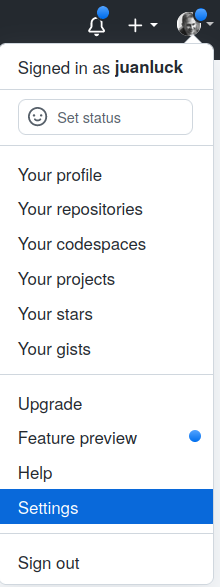

<style>
.note {
  min-height: 17px;
  margin: 4px 0 2px;
    margin-bottom: 2px;
  font-size: 12px;
  color: #000000;
  font-size: 14px !important;
  padding: 16px !important;
  margin-bottom: 24px !important;
  border-color: #000000; !important;
  background-color: rgba(84,174,255,0.4); !important;
  border-radius: 4px !important;
  border: 1px solid #000000; !important;
}
</style>

<a id='TP2'></a>
# TP 2: Trabajar de forma autónoma en un repositorio GitHub remoto
[Volver a la página principal](../index.md)

Hasta ahora (en el [TP1](../tp1/index.md)), hemos estado trabajando en un repositorio local. Sin embargo, el verdadero poder de git radica en la posibilidad de trabajar con un repositorio remoto (generalmente alojado en un servidor externo), lo que ofrece las siguientes ventajas: i) tener una copia de seguridad del proyecto, ii) la capacidad de acceder al proyecto desde diferentes máquinas y iii) la posibilidad de trabajar en equipo en el mismo proyecto.

En este TP, trabajaremos de forma autónoma (aún no hay trabajo en equipo) en un repositorio remoto. Seguramente ya conozcas algunas de estas plataformas de gestión de proyectos, hay varias. **Las más conocidas son:**

[Github](https://github.com):
:	La plataforma más conocida. Ofrece alojamiento gratuito para proyectos. Suscripciones para más características. El código se aloja en GitHub.

[Bitbucket](https://bitbucket.org):
:	Similar a GitHub. Programa para estudiantes (con correo electrónico universitario). El código se aloja en Bitbucket, propiedad de Atlassian.

[Gitlab](https://about.gitlab.com/):
:	Similar a las anteriores en su versión comercial (Enterprise Edition). Una versión de código abierto (Community Edition) permite la instalación de un servidor privado.

---

## Objetivos del TP 2

El objetivo de este segundo TP es comenzar a trabajar de forma autónoma (sin trabajo en equipo por ahora) con un repositorio git remoto. En particular, trabajaremos con el sistema de GitHub. En este TP, aprenderemos a:

> 1. [Crear una cuenta en GitHub](#github).
2. [Agregar una nueva clave SSH a tu cuenta de GitHub](#cle).
3. [Subir un repositorio existente desde la línea de comandos](#pushremote).
4. [Secuencia de trabajo con un repositorio remoto](#sequence).
5. [Clonar un repositorio remoto en nuestra máquina local](#clone).

[Arriba de la página](#TP2)


---

<a id='github'></a>
## 1. Crear una cuenta en GitHub

Es posible que algunos de ustedes ya tengan una cuenta en GitHub. Si es así, pueden omitir este primer paso. De lo contrario, crear una cuenta en GitHub es sencillo:

1. Deben ir a [GitHub](https://github.com) y hacer clic en **Sign up** para registrarse:

   

2. Luego, deben completar los campos del formulario a continuación. Tómense unos minutos para crear su cuenta:

   


---
<a id='cle'></a>
## 2. Agregar una nueva clave SSH a tu cuenta de GitHub

Por razones de seguridad, GitHub se basa en un sistema de clave pública/privada para las conexiones. Esta sección te permite configurar estas claves en GitHub.

- Copia la clave pública SSH de tu máquina en tu portapapeles.

```shell
$ cat ~/.ssh/id_rsa.pub
# Luego, selecciona y copia el contenido del archivo id_rsa.pub
# que se muestra en la terminal a tu portapapeles
```

<div class="note">
<p><strong>Atención:</strong> La clave pública es la que termina en .pub, nunca compartas tu clave privada.</p>

<p>El archivo id_rsa.pub es el nombre predeterminado, pero es posible que tu archivo tenga un nombre diferente, como identificador.pub u otro.</p>

<p>Si no tienes un par de claves pública/privada en tu directorio .ssh, el comando <code>ssh-keygen</code> permite generar un par de claves pública/privada RSA.</p>
</div>

- En la esquina superior derecha, haz clic en tu foto de perfil y luego en Configuración.

  

- En la sección "Acceso" de la barra lateral, haz clic en **Claves SSH y GPG**.

- Haz clic en **Nueva clave SSH** o en **Agregar clave SSH**.

- En el campo "Título", agrega una etiqueta descriptiva para la nueva clave. Por ejemplo, si estás utilizando tu portatil lenovo, puedes llamar a esta clave "Mi portatil lenovo".

- Pega tu clave en el campo "Clave".

- Haz clic en "Agregar clave SSH".

- Si se te pide, confirma tu contraseña de GitHub.

- Puedes repetir este proceso para todas las máquinas que vayas a utilizar.

[Arriba de la página](#TP2)

-----

<a id='pushremote'></a>
## 3. Subir un repositorio existente desde la línea de comandos

Hasta ahora, hemos estado trabajando en el repositorio git local `tp1`, es hora de respaldar este repositorio en GitHub. Para hacerlo, seguiremos una descripción que muestra cómo hacerlo paso a paso. Pero primero, es conveniente hacer una breve introducción a tres comandos en git que nos ayudarán a administrar nuestro repositorio remoto desde nuestro repositorio local en la línea de comandos.

* `git remote`:
: Este comando se utiliza para gestionar (agregar) repositorios remotos ("remotes"). En otras palabras, utilizaremos este comando para crear un enlace entre nuestro repositorio local `tp1` y el repositorio remoto que crearemos en GitHub.

* `git push`:
: Este comando permite actualizar el repositorio remoto (por ejemplo, GitHub) a partir de la última versión validada (_commit_) de nuestro repositorio local.

* `git pull`:
: Este comando se utiliza para actualizar nuestro repositorio local a partir de la última versión de nuestro repositorio remoto.

**¿Estás listo? ¡Vamos a empezar a trabajar con GitHub!** La primera tarea será respaldar una copia de nuestro repositorio local `tp1` en GitHub.

* Ve al directorio tp1, de modo que el comando `pwd` muestre el siguiente resultado:


```shell
$:> pwd
/.../cursoGIT/tp1 
```

* En el sitio web de GitHub, ve arriba a la derecha y haz clic en **New repository** como se muestra en la imagen:

  

* En el formulario, escribe **tp1** en **Nombre del repositorio** y deja los demás campos en blanco (como se muestra en la imagen). Puedes elegir si tu repositorio `tp1` será público o privado.

  

* Acabas de crear un repositorio vacío cuyo enlace `https://github.com/<tu_usuario>/tp1.git` se mostrará como en la imagen a continuación.

  

* Escribe en la consola la siguiente línea para verificar que tu repositorio local `tp1` aún no está vinculado a un repositorio remoto. La respuesta de este comando no debe mostrar nada.


```shell
$:~/cursoGIT/tp1> git remote -v
```

* Ahora vamos a vincular nuestro repositorio local `tp1` al repositorio remoto `git@github.com:<tu_usuario>/tp1.git`. Para hacerlo, escribe el siguiente comando siguiente, reemplazando `<tu_usuario>` por tu nombre de usuario de GitHub.

```shell
$:~/cursoGIT/tp1> git remote add origin git@github.com:<tu_usuario>/tp1.git
```

* Hasta ahora, no hemos explorado el concepto de ramas en Git y no entraremos en detalles hasta el próximo TP. Sin embargo, es importante saber que todas las versiones que guardamos con diferentes _commits_ se almacenan en una rama. Normalmente, esta rama se llamará **master** o **main**. Para finalizar la configuración de la conexión entre el repositorio local y remoto, necesitaremos conocer el nombre de esta rama. Para hacerlo, escribe el siguiente comando:


```shell
$:~/cursoGIT/tp1> git branch
*master
```

* Ahora solo falta crear el enlace de forma permanente y actualizar el repositorio remoto. Para hacerlo, escribamos el siguiente comando:

```shell
$:~/cursoGIT/tp1> git push -u origin master
```

* Mientras que el comando `git push` intenta escribir en el repositorio remoto, deberías ver mensajes similares a:

```shell
Counting objects: 19, done.
Delta compression using up to 4 threads.
Compressing objects: 100% (14/14), done.
Writing objects: 100% (19/19), 2.11 KiB | 0 bytes/s, done.
Total 19 (delta 0), reused 0 (delta 0)
To https://github.com/juanluck/tp1.git
 * [new branch]      master -> master
Branch master set up to track remote branch master from origin.
```
* **¡Felicidades!** Ahora los dos repositorios, local y remoto, están sincronizados. Ve al sitio de tu proyecto `https://github.com/<tu_usuario>/tp1` y comprueba los resultados. **¿No es genial?**

[Arriba de la página](#TP2)

-----

<a id='sequence'></a>
## 4. Secuencia de trabajo con un repositorio remoto

En el [tp1](../tp1/index.md), aprendimos cómo establecer una secuencia de trabajo sencilla en un directorio local para rastrear las diferentes versiones de nuestro proyecto utilizando la siguiente secuencia de comandos: `git status` -> `git add archivo` -> `git commit -m "mensaje"` -> `git status` -> `git add archivo` -> `...`

Una vez que se ha establecido la conexión entre nuestro repositorio local y el repositorio remoto, introduciremos los comandos `git pull` y `git push` en esta secuencia y podremos sincronizar el _commit_ local con el repositorio remoto. En resumen, esta secuencia consta de los siguientes comandos:

* En primer lugar, realizaremos un _pull_ (descargar y sincronizar) la versión más reciente del repositorio remoto con nuestro repositorio local:

```shell
$:~/cursoGIT/tp1> git pull
```

* **(Opcional)** Podemos ver las modificaciones más recientes (realizadas por nosotros o un colega) si escribimos:

```shell
$:~/cursoGIT/tp1> git log
```

* Una vez que tenemos la versión más reciente, podemos comenzar a introducir cambios en nuestros archivos locales y llevar a cabo la secuencia que ya conocemos para registrar la nueva versión en nuestro repositorio local:

```shell
$:~/cursoGIT/tp1> git status
$:~/cursoGIT/tp1> git add <archivos>
$:~/cursoGIT/tp1> git commit -m "Mensaje para el log"
```

* Finalmente, una vez que nuestro repositorio local tiene la versión correcta, simplemente debemos sincronizarlo (_hacer push_) con el repositorio remoto utilizando el comando:

```shell
$:~/cursoGIT/tp1> git push
```
 
### Ejercicio
> 1. Modifica el archivo Criptomoneda.java con el siguiente código. Para sincronizar los repositorios correctamente, comienza con un `git pull` -> `git log`, luego modifica el archivo y continúa con la secuencia `git status` -> `git add Criptomoneda.java` -> `git commit -m" Agregar getters y setters "` - > `git push`. Verifica que el repositorio de GitHub se haya actualizado.

```java
public class Criptomoneda{
    private String nombre;
    private double valorDeToken; // Imaginemos en euros

    public Criptomoneda(String nombre, double valorDeToken){
        this.nombre = nombre;
        this.valorDeToken = valorDeToken;
    }

    public String getNombre() {
        return nombre;
    }

    public double getValorDeToken() {
        return valorDeToken;
    }

    @Override
    public String toString() {
        return String.format("%5s",nombre) + ":" + String.format("%10.1f",valorDeToken);
    }
}
```

[Arriba de la página](#TP2)

-----
<a id='clone'></a>
## 5. Clonar un repositorio remoto en nuestra máquina local

En la [sección 3](#pushremote), aprendimos a inicializar un repositorio localmente (con `git init`) y luego sincronizarlo con un repositorio remoto. Sin embargo, en la mayoría de los casos, utilizaremos un **método mucho más sencillo** para vincular los dos repositorios: **la clonación**. Para aprender este proceso, crearemos un nuevo repositorio en GitHub que llamaremos `tp2` (**adiós tp1**).

<div class="note">
	<strong>NOTA:</strong> Cuando adquiera más experiencia, verá lo común y sencillo que es el clonar un repositorio remoto. En este ejercicio, estamos reproduciendo este flujo de trabajo.
</div>

* Vamos directamente a GitHub para crear un nuevo repositorio `tp2` siguiendo el formulario a continuación:


* Acabas de crear un nuevo repositorio `tp2`. Para obtener el enlace para clonarlo, haz clic en <mark style="background-color:green;color:white">Code</mark> como se muestra en la siguiente imagen:


* Ahora, simplemente ve al directorio del cursoGIT:


```shell
$:~/cursoGIT> ls
tp1
```

* y escribe el comando siguiente:

```shell
$:~/cursoGIT> git clone git@github.com:<votre_utilisateur>/tp2.git
```

* Si escribimos ahora el comando `ls`, veremos que se ha creado un nuevo directorio `tp2`. Este directorio contiene un repositorio local que ya está vinculado y sincronizado con el repositorio remoto en GitHub _(a diferencia de la [sección 2](#pushremote), no necesitaremos configurar la conexión con `git remote` ni con `git push -u origin master`. ¡Así de sencillo!)._

```shell
$:~/cursoGIT> ls
tp1 tp2
```
### Ejercicios
> 1. Ve al directorio `tp2` y actualiza todos los archivos con los del directorio `tp1` (README.md y src/Criptomoneda.java) (asegúrate de no copiar el directorio oculto .git).
2. Utilizando [la secuencia](#sequence) que hemos aprendido, sincroniza los repositorios local y remoto.

[Regresar al inicio de la página](#TP2)


-----

**Fin del TP2**