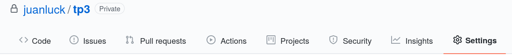
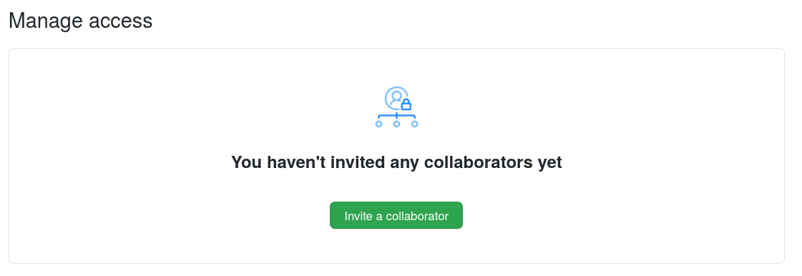
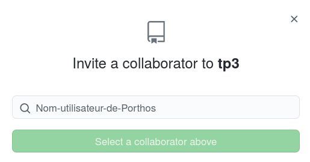

<a id='TP3'></a>
# TP 3: Trabajar en equipo en un repositorio remoto de GitHub
[Volver a la página principal](../index.md)

Es hora de comenzar a usar Git para el trabajo en equipo. De hecho, Git fue diseñado inicialmente con este propósito, y aquí es donde puede mostrar su poder.

Antes de continuar, vamos a organizarnos en parejas. Si son un número impar, un equipo puede estar compuesto por tres personas a pesar de que el TP esté diseñado para dos roles.

**¿Ya han formado equipos?** Lanzad una moneda y decidid quién asumirá el papel de <mark style="background-color:red;font-weight:bold; color:white">Athos</mark> y quién asumirá el papel de <mark style="background-color:green;font-weight:bold; color:white">Porthos</mark> para este trabajo práctico. Si son tres personas, dos de ellas estarán agrupadas en el papel de <mark style="background-color:red;font-weight:bold; color:white">Athos</mark>.

 
---

## Objetivos del TP 3

El objetivo de este tercer TP es comenzar a trabajar en equipo en GitHub y desarrollar un mercado para el proyecto de criptomonedas que ya habíamos iniciado. En este TP, aprenderemos a:

> 1. [Invitar colaboradores a un repositorio personal](#collaborateurs)
2. [Desarrollar un proyecto Java en equipo](#projet)
3. [Gestionar nuevas funcionalidades utilizando ramas (branches)](#branch)

[Regresar al inicio de la página](#TP3)

---

<a id='collaborateurs'></a>
## 1. Invitar colaboradores a un repositorio personal

<mark style="background-color:red;font-weight:bold; color:white">Athos</mark>:

* Para comenzar, <mark style="background-color:red;font-weight:bold; color:white">Athos</mark> creará un nuevo repositorio en su cuenta de GitHub llamado `tp3` (<mark style="background-color:green;font-weight:bold; color:white">Porthos</mark> debería observar y comentar con <mark style="background-color:red;font-weight:bold; color:white">Athos</mark> cómo se hace). Llenaremos el formulario de la misma manera que lo hicimos con el repositorio `tp2`.

* Una vez creado el repositorio, hagan clic en **Configuración**:



* Luego en **Administrar acceso** y después en **Invitar a un colaborador**:



* Soliciten el nombre de usuario de GitHub de <mark style="background-color:green;font-weight:bold; color:white">Porthos</mark> e invítenlo a su repositorio:



<mark style="background-color:green;font-weight:bold; color:white">Porthos</mark>:

* <mark style="background-color:green;font-weight:bold; color:white">Porthos</mark> debe ir a su correo electrónico para recibir la invitación de <mark style="background-color:red;font-weight:bold; color:white">Athos</mark> para colaborar en el repositorio `tp3` y aceptarla.

<mark style="background-color:red;font-weight:bold; color:white">Athos</mark>  y <mark style="background-color:green;font-weight:bold; color:white">Porthos</mark>:

* Cada uno de ustedes puede clonar el proyecto ubicándose en el directorio `cursoGIT`:

```shell
$:~/cursoGIT> git clone git@github.com:<tu_usuario>/tp3.git
```

* Si lo has hecho correctamente, tu directorio `cursoGIT` debería contener tres directorios como se muestra a continuación:

```shell
$:~/cursoGIT> ls
tp1 tp2 tp3
```

### Ejercicios
> 1. <mark style="background-color:green;font-weight:bold; color:white">Porthos</mark>: ve al directorio `tp3` y actualiza todos los archivos con los del directorio `tp2` (README.md y src/Criptomoneda.java) (asegúrate de no copiar el directorio oculto .git). Sincroniza los repositorios local y remoto.
2. <mark style="background-color:red;font-weight:bold; color:white">Athos</mark>: después de que <mark style="background-color:green;font-weight:bold; color:white">Porthos</mark> te informe, realiza un `git pull` desde tu directorio local `tp3` para sincronizar los cambios.
3. Ambos: verifica que todos los repositorios estén sincronizados correctamente (lo que está en GitHub coincide con lo que tienes en tu directorio local).

[Regresar al inicio de la página](#TP3)

-----

<a id='projet'></a>
## 2. Desarrollo de un proyecto Java en equipo

Git fue diseñado principalmente para gestionar el trabajo en equipo. Volvamos al proyecto de Criptomonedas, para el cual crearemos un mercado con diferentes carteras. Antes de comenzar, describamos algunos conceptos:

**Cartera:**
: Una cartera criptográfica es una cartera virtual en la que un usuario puede almacenar una cierta cantidad de tokens de una criptomoneda. Este usuario puede poseer varias carteras, pero cada cartera solo puede contener un tipo de criptomoneda. Una cartera permite compras de tokens y transferencia de tokens entre carteras si el tipo de criptomoneda es el mismo.

**Mercado:**
: El mercado es un registro con una serie de carteras criptográficas. En principio, el mercado nos permite hacer ciertas preguntas, como cuál es el capital total de un usuario con varias carteras o cuál es el capital total en circulación de una criptomoneda específica.

<mark style="background-color:red;font-weight:bold; color:white">Athos</mark>  y <mark style="background-color:green;font-weight:bold; color:white">Porthos</mark>:

* Antes de continuar, asegúrense de que su repositorio `tp3` esté perfectamente sincronizado.

<mark style="background-color:red;font-weight:bold; color:white">Athos</mark>:

* Copia los siguientes archivos en el directorio `tp3/src`, valida en el repositorio local y remoto:
   * [CriptoMercado.java](./src/CriptoMercado.java)
   * [Cartera.java](./src/Cartera.java)
   * [TestCriptoMercado.java](./src/TestCriptoMercado.java) 

<mark style="background-color:green;font-weight:bold; color:white">Porthos</mark>:
* Asegúrate de obtener la última versión del repositorio remoto.

<mark style="background-color:red;font-weight:bold; color:white">Athos</mark>  y <mark style="background-color:green;font-weight:bold; color:white">Porthos</mark>:

* Su misión será completar la funcionalidad que falta para terminar nuestra aplicación de mercado de criptomonedas. <mark style="background-color:green;font-weight:bold; color:white">Porthos</mark> se enfocará en la implementación de la clase **Cartera.java** y <mark style="background-color:red;font-weight:bold; color:white">Athos</mark> en la implementación de la clase **CriptoMercado.java**. **El objetivo es pasar las pruebas descritas en el archivo TestCriptoMercado.java (no se permite modificar este archivo).**
* Antes de continuar, compilen todo el código y asegúrense de que no haya errores de compilación.
* Ejecuten en la línea de comandos `java TestCriptoMercado`. La respuesta debería ser la siguiente:

```shell
Test Cartera transferenciaDivisa          ... FAIL
Test Cartera compraDivisa                 ... FAIL
Test CriptoMercado capitalEnEuros         ... FAIL
Test CriptoMercado capitalMoneda          ... FAIL
```

<mark style="background-color:red;font-weight:bold; color:white">Athos</mark> :

* Su tarea consiste en completar la implementación de las dos siguientes funciones en la clase **CriptoMercado.java**. Sigan las especificaciones en los comentarios para completarlas. Una vez terminado, sincronicen sus cambios con el repositorio local y remoto.

```java
    /**
     * Esta función busca en el mercado todas las carteras
     * del propietario y calcula su capital en euros.
     * @param proprietario
     * @return capital en euros del propietario.
     */
    public double capitalEnEuros(String propietario){
        /**
			FUNCIONALIDAD A IMPLEMENTAR
        **/
        return 0;
    }

    /**
     * Esta función busca en el mercado todas las carteras
     * de un tipo de moneda y calcula el volumen total de capital de
     * esa moneda en el mercado.
     * @param moneda
     * @return capital total en circulación de la criptomoneda (en euros).
     */
    public double capitalMoneda(Criptomoneda moneda){
        /**
			FUNCIONALIDAD A IMPLEMENTAR
        **/
        return 0;
    }
```


 <mark style="background-color:green;font-weight:bold; color:white">Porthos</mark> :

* Su tarea consiste en completar la implementación de las dos siguientes funciones en la clase **Cartera.java**. Sigan las especificaciones en los comentarios para completarlas. Una vez terminado, sincronicen sus cambios con el repositorio local y remoto.
 
```java
  /**
   * Esta función te permite transferir monedas desde la cartera actual
   * a la cartera de destino por la cantidad indicada. El tipo de moneda
   * (nombre del token) debe ser el mismo en ambas carteras y la cantidad
   * en la cartera actual debe ser mayor o igual a la indicada.
   * @param destino
   * @param cantidadTokens
   * @return true si la transacción se realizó, false en caso contrario.
   */
  public boolean transferenciaDivisa (Cartera destino, double cantidadTokens){
      /**
           FUNCIONALIDAD A IMPLEMENTAR
	  **/
      return false;
  }

  /**
   * Esta función te permite comprar tokens de la criptomoneda
   * en función de su valor en euros. El resultado es el aumento 
   * de los tokens de la criptomoneda.
   * @param cantidadEuros Valor de compra en euros
   * @return true si el monto en euros es mayor o igual a 0
   */
  public boolean compraDivisa (double cantidadEuros){
	/**
           FUNCIONALIDAD A IMPLEMENTAR
	**/
    return false;
  }
```

### Ejercicio
> 1. Realiza los pasos anteriores. Una vez que los repositorios estén sincronizados, <mark style="background-color:red;font-weight:bold; color:white">Athos</mark> y <mark style="background-color:green;font-weight:bold; color:white">Porthos</mark> deben compilar y ejecutar la prueba `java TestCriptoMercado`. El resultado debe ser el siguiente:

```shell
Test Cartera transferenciaDivisa          ... OK
Test Cartera compraDivisa                 ... OK
Test CriptoMercado capitalEnEuros         ... OK
Test CriptoMercado capitalMoneda          ... OK
``` 

[Regresar al inicio de la página](#TP3)

-----


<a id='branch'></a>
## 3. Gestionar nuevas funcionalidades utilizando ramas

Después de lanzar el proyecto conjunto del mercado de criptomonedas, <mark style="background-color:red;font-weight:bold; color:white">Athos</mark> y <mark style="background-color:green;font-weight:bold; color:white">Porthos</mark> deciden abordar nuevos proyectos por separado. En particular, cada uno de ellos decide lanzar su propia criptomoneda, respectivamente: **AthosCoin** y **PorthosCoin**. Para integrar estas monedas en el mercado existente, vamos a utilizar **el concepto de ramas en Git.**

Hasta ahora, sin necesidad de saberlo, todas las modificaciones que hemos realizado en el repositorio se han hecho en una rama principal llamada **main** o **master** (el nombre depende de la configuración). Si escribes `git branch`, obtendrás ese nombre. Sin embargo, si deseas crear una nueva funcionalidad en tu código (no necesariamente una funcionalidad principal, sino una funcionalidad adicional), Git te permite crear una nueva rama: un desvío en la secuencia de cambios.

### 3.1. Probar el concepto de rama con un ejemplo sencillo

<mark style="background-color:red;font-weight:bold; color:white">Athos</mark> y <mark style="background-color:green;font-weight:bold; color:white">Porthos</mark>:

* Imaginemos que queremos probar una nueva funcionalidad en nuestro proyecto que llamaremos **"test"**. Esta funcionalidad puede integrarse directamente en la rama principal **main** (como hemos hecho hasta ahora) o podemos probarla en una rama separada, verificar si funciona y luego integrarla en la rama principal. Probemos este segundo caso.

* Comencemos por listar todas las ramas actuales de nuestro repositorio con `git branch` y luego veamos el contenido de esa rama:

```shell
$:~/cursoGIT/tp3> git branch
* main
$:~/cursoGIT/tp3> tree
.
├── README.md
└── src
    ├── CriptoMercado.java
    ├── Criptomoneda.java
    ├── Cartera.java
    └── TestCriptoMercado.java
```

* Con `git log`, también podemos ver todas las modificaciones que hemos realizado hasta el momento. Pasemos algunos parámetros a la orden para que sea más legible.

```shell
$:~/courseGIT/tp3> git log --graph --oneline --all --decorate --topo-order
* 922b42b (HEAD -> main) Adding CriptoMercado
* 177514f (origin/main, origin/HEAD) Starting tp3++
* e7820d8 Starting tp3
* 455453c Initial commit
```

* Es hora de crear una nueva rama que llamaremos **test**. Utiliza el siguiente comando:

```shell
$:~/cursoGIT/tp3> git checkout -b test
Switched to a new branch 'test'
```
* La opción `-b` nos permite indicar a `checkout` que vamos a crear esta nueva rama. `checkout` nos cambia a la nueva rama y nos lleva a la rama **test** (todas las modificaciones realizadas a partir de ahora no afectarán a la rama **main** sino a la rama **test**). Para asegurarnos de que estamos en la rama **test**, escribimos:

```shell
$:~/cursoGIT/tp3> git branch
  main
* test
```
* El asterisco * indica que esta es la rama de trabajo actual. Si deseamos cambiar entre ramas, podemos utilizar el comando `git checkout <nombre_rama>`.

* Comencemos por crear un nuevo archivo "test.txt" en la rama **test**. Para hacerlo, escribe:


```shell
$:~/cursoGIT/tp3> touch test.txt
$:~/cursoGIT/tp3> ls
README.md  src  test.txt
```
* Y luego validemos estos cambios en el repositorio local:

```shell
$:~/cursoGIT/tp3> git add test.txt
$:~/cursoGIT/tp3> git commit -m "archivo test.txt añadido"
```
* Olvidemos por un momento la rama **test** y volvamos a la rama principal **main**, luego escribe el comando `ls`:

```shell
$:~/cursoGIT/tp3> git checkout main
$:~/cursoGIT/tp3> ls
README.md  src
```
**¿Qué ha sucedido? ¿Dónde ha ido el archivo _test.txt_?**

* Imagina que estamos siguiendo el desarrollo en la rama principal. Para simular esto, modifica el archivo README.md agregando la línea: "Hemos creado una nueva rama de prueba". Realiza un `git add README.md` y luego un `git commit -m "nuevo commit en la rama principal"`. Después escribe el comando:


```shell
$:~/courseGIT/tp3> git log --graph --oneline --all --decorate --topo-order
* f721aae (HEAD -> main) nuevo commit en la rama principal
| * bee45b2 (test) archivo test.txt añadido
|/  
* 922b42b Adding CriptoMercado
```

* Puedes ver en la salida del registro de cambios (log) que se ha producido una bifurcación en el código. Visualmente, ahora hay una rama principal y una rama de prueba:


```shell
* (main)
| * (test) 
|/ 
* (main)
```

### 3.2. Fusionar la rama de prueba en la rama principal

<mark style="background-color:red;font-weight:bold; color:white">Athos</mark> y <mark style="background-color:green;font-weight:bold; color:white">Porthos</mark>:

* Trabajar con ramas sería inútil si en algún momento no pudiéramos fusionarlas. Imaginemos que queremos agregar la funcionalidad **test** a nuestra rama principal. Para hacerlo, vamos a la rama principal con el siguiente comando:

```shell
$:~/cursoGIT/tp3> git checkout main
```

* y luego usamos el comando git merge, que nos permite fusionar ramas:

```shell
$:~/cursoGIT/tp3> git merge test
```

* para visualizar la fusión, puedes escribir el siguiente comando:

```shell
$:~/cursoGIT/tp3> git log --graph --oneline --all --decorate --topo-order
*   454d00d (HEAD -> main) Merge branch 'test' into main
|\  
| * bee45b2 (test) archivo test.txt añadido
* | f721aae nuevo commit en la rama principal
|/  
* 922b42b Adding CriptoMercado
```

* **¿Qué ocurre si escribimos el comando `ls`?**

```shell
$:~/cursoGIT/tp3> ls
???
```

### Ejercicios
1. <mark style="background-color:red;font-weight:bold; color:white">Athos</mark> y <mark style="background-color:green;font-weight:bold; color:white">Porthos</mark> realizarán las secciones 3.1 y 3.2 por separado sin sincronizar con el repositorio de GitHub.
2. Luego, eliminen el archivo test.txt del repositorio. Para hacerlo, escriban el comando `git rm test.txt` y luego `git commit -m "test.txt eliminado"`.
3. Cada uno de ustedes creará una rama llamada **AthosCoin** y **PorthosCoin**, respectivamente. En esta rama, crearán su propia criptomoneda (sigan el ejemplo de AramisCoin a continuación). Una vez que hayan creado la moneda, fusionen la rama con la rama principal. Asegúrense luego de que las modificaciones estén sincronizadas en el repositorio de GitHub.

```java
public class AramisCoin extends Criptomoneda{
    public AramisCoin(){
        super("ARA", 1000);
    }
}
```
[Regresar al principio de la página](#TP3)

-----

**Fin del TP3**